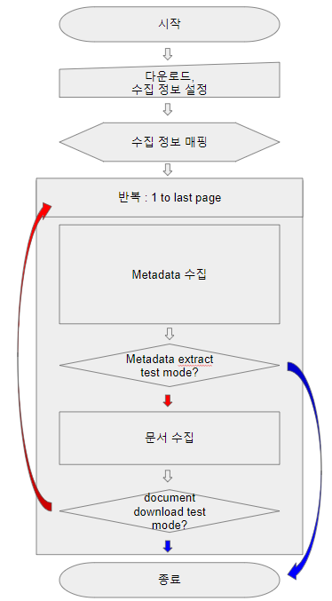

[AE] Article Extractor
==========================
# 0. 언어 정의
    * layout -analysis 
        * In computer vision, document layout analysis is the process of identifying and categorizing the regions of interest in the scanned image of a text document.
        * 문서 레이아웃을 분류하고 식별하는 과정
        
    *  Metadata
        * Data (information) that provides information about other data
        * 데이터에 대한 정보를 제공하는 데이터
            * ex) title, author, created, doi etc.
            
    *  수집 
        * Metadata 수집
            * 문서에 대한 정보를 text 데이터로 저장하는 것
        * 문서 수집
            * 문서의 binary file을 저장하는 것
            * 다운로드
# 1. 목적
    * 문서 레이아웃 분석 프로젝트 "layout-analysis-worker"에 활용할 데이터셋 수집
# 2. 요구 사항
    * Metadata 수집 기능
    * Metadata 수집 테스트 기능
    * 문서 수집 기능
    * 문서 수집 테스트 기능
    * 수집 설정 입력 기능
            
# 2. 수집 운영 환경
    * OS  : Microsoft Windows 버전 1803 (OS 빌드 : 17134.829)
    * CPU : intel i5-8250U CPU @  1.60GHz
    * RAM : 4 GB
   
# 3. 개발 환경
    * 수집 운영 환경과 동일
        
# 4. 사용 언어
    * JAVA
        * version "1.8.0_212"
    * MySQL
        * 보류
            * layout-analysis에 있어 과연 Metadata의 저장이 필요한가 고민 중
                * 찬성
                    * 언제 어떻게 쓰일지 모른다.
                    * 다운로드 링크도 Metadata다.
                * 반대
                    * 이미지만 활용할 것이기 때문에 필요하지 않다.
                    * 다운로드 실패하면 그냥 continue하게 운영하면 된다.
                    * 로그를 남기는 것만으로 충분하다.
        
# 5. 수집 프로세스
